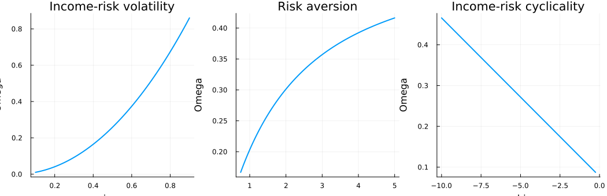
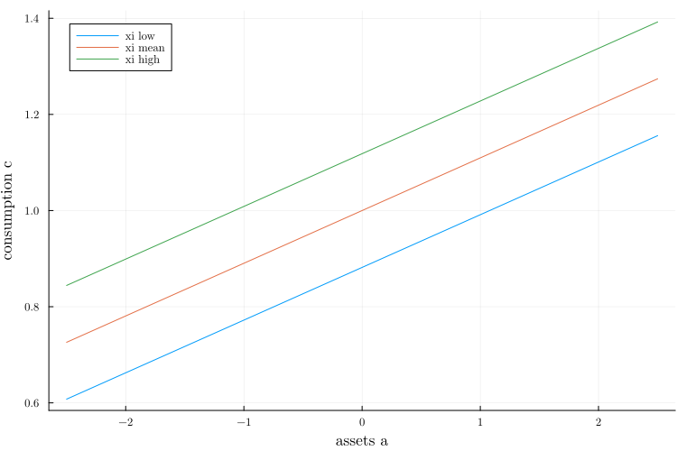
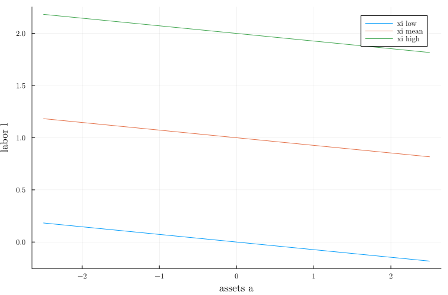

## Project Overview

This CCA CompEcon project prepares a Julia replication-light implementation of
Acharya, Challe, and Dogra (2023), "Optimal Monetary Policy According to HANK."
The paper studies optimal monetary policy in a heterogeneous-agent New Keynesian
model where policy affects not only inflation and productive efficiency, but
also consumption inequality. The computational goal of this repository is to
make a reproducible Julia package that exposes the central analytical objects,
checks their numerical consistency, and generates a compact set of figures for
the hand-in.

The package is named `HANKPolicies`. Its unique entry point is:

```julia
using HANKPolicies
run()
```

The command writes figures and a CSV file to `images/`.

## Paper and Replication Goal

The paper's key insight is that a HANK planner faces an additional inequality
stabilization motive. In the tractable model, this motive can be summarized by
the weight `Omega`, which depends on primitives such as income-risk volatility,
risk aversion, and the cyclicality of idiosyncratic risk. The replication target
here is not a full line-by-line translation of the original Matlab package.
Instead, it implements the formulas used for the policy functions, comparative
statics, and selected impulse-response figures that were prepared from the
notebook script in this repository.

## Data and Code Used

No external micro data are required for this hand-in version. The project uses
the paper's analytical structure and calibration-style parameters to compute:

- the closed-form household consumption policy,
- the associated labor and savings policies,
- the `Omega` comparative statics,
- flow utility over an asset grid,
- a policy-evaluated value function using Gauss-Hermite quadrature.

The Julia source lives in `src/HANKPolicies.jl`. The original notebook-export
script used during development is preserved in `scripts/`, while the package
entry point writes the final generated outputs to `images/`.

## Julia Implementation

The implementation defines a `HANKParams` parameter object and helper functions
for the analytical policy rules. For assets `a` and idiosyncratic labor
disutility shock `xi`, the package evaluates cash-on-hand, consumption, labor,
next-period assets, and flow utility. The value function is evaluated under the
closed-form policy rules rather than solved as a separate constrained dynamic
program.

The tests in `test/runtests.jl` check package loading, basic analytical
relationships, and a small-grid execution of `run()`. This keeps the test suite
fast while still verifying the full plotting pipeline.

## Main Results

Figure 1 shows the comparative statics of the HANK policy weight `Omega`.
Higher income-risk volatility and changes in risk aversion or the cyclicality
of risk alter the planner's relative concern for inequality stabilization.



The package also plots the closed-form household policies. Consumption is
linear in cash-on-hand with slope `mu`; labor and savings inherit the same
analytical structure from the household problem.






The final diagnostic figure evaluates the value function induced by the
analytical policy rules over the asset grid and selected shock states.


The notebook-export script also produced paper-style exhibits that are retained
for reference. The main figures are copied into `images/` for easy discovery.


## Reproducibility Checklist

- `Project.toml` declares the Julia package and dependencies.
- `src/HANKPolicies.jl` exports `run()`.
- `test/runtests.jl` provides package and smoke tests.
- `README.md` documents installation, running, testing, and report rendering.
- `.github/workflows/publish.yml` renders this Quarto report to GitHub Pages.

## Conclusion

The repository is organized as a standard Julia package for the CompEcon
hand-in. The implementation keeps the scientific logic close to the existing
scripts, wraps the main reproducible outputs behind `run()`, and documents the
results in a Quarto report that can be rendered locally or published online
through GitHub Pages.

## References

Acharya, Sushant, Edouard Challe, and Keshav Dogra. 2023. "Optimal Monetary
Policy According to HANK." *American Economic Review* 113 (7): 1741-1782.
<https://www.aeaweb.org/articles?id=10.1257/aer.20200239>

Replication package: <https://doi.org/10.3886/E184261V1>
