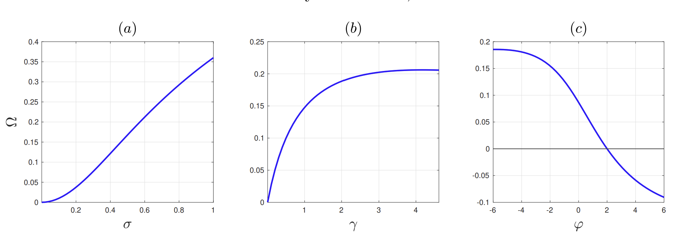
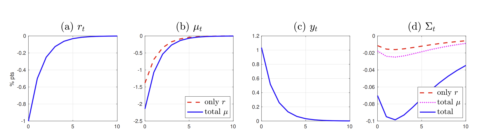

::: {.callout-note appearance="simple" title="Authors"}
Lorenzo Castro De Salvo: <lorenzo.castrodesalvo@carloalberto.org>  
Paolo Diotallevi: <paolo.diotallevi@carloalberto.org>
:::


## Project

This is our CCA CompEcon replication project based on Acharya, Challe and Dogra, **"Optimal Monetary Policy According to HANK"**. The goal is to reproduce selected figures from the paper in Julia and to add a small original numerical exercise on household policy and value functions.

- Paper: <https://www.aeaweb.org/articles?id=10.1257/aer.20200239>
- Replication package: <https://doi.org/10.3886/E184261V1>
- GitHub repository: <https://github.com/LorenzoCastroDeSalvo/final_project_CE>

## Computational Problem

The computational part is mainly deterministic. For Figures 1 and 2 we solve steady-state equations and simulate the model responses using Julia root-finding and recursions. For the household side, we implement the analytical policy rules from the paper and evaluate the value function on an asset grid using Gauss-Hermite quadrature for the idiosyncratic shock.

In short, the project translates the relevant formulas into a Julia package, checks the main analytical relationships, and produces the replicated figures through a single entry point, `run()`.

## Our Computational Setup

The computations were run on a Windows laptop: ASUS Zenbook UX3402VA, Windows 11 Home, Intel Core i7-13700H processor with 14 cores and 20 logical processors, and 16 GB RAM. The project uses Julia with the package environment defined in `Project.toml` and `Manifest.toml`; the report was rendered with Quarto 1.9.37.

The main reproduction command is:

```powershell
julia --project=. run_all.jl
```

## Replicated Results

Before presenting the replicated figures, we summarize the model objects that are directly implemented in the Julia code. This gives context to the two exhibits without reproducing the full derivation of the paper.

### Context for Figure 1

Figure 1 is a comparative-statics exercise for the welfare-relevant coefficient $\Omega$. In the paper and in our code, $\Omega$ is recomputed while varying income-risk dispersion $\sigma$, risk aversion $\gamma$, and the cyclicality parameter $\varphi$, holding the rest of the baseline calibration fixed.

The code first solves for the steady-state wage $w$. Given $w$, the main objects are

$$
\Lambda=(\gamma\mu w\sigma)^2,
\qquad
\Theta=1-\frac{\Lambda\varphi}{\gamma}.
$$

The coefficient plotted in Figure 1 is

$$
\Omega=
\frac{\Theta-1+\Lambda}{(1-\tilde\beta)(1-\Lambda)}.
$$

In the Julia file, the same formula is implemented in two steps: first `OMEGA_code = (THETA - 1 + LAM)/(1 - LAM)`, then `Omega = OMEGA_code/(1 - btil)`. The figure is generated by repeatedly calling `make_compstats_like` on the three parameter grids and then saving the result with `save_figure(fig1, "figure1")`.

### Context for Figure 2

Figure 2 studies the effect of a mean-reverting cut in the real interest rate on output, passthrough, and consumption inequality. The shock path used in the code is

$$
\hat r_t=r_0\rho_r^t,
$$

with `r0 = -0.01` and `rho_r = 0.5`, corresponding to an initial 100 basis point cut that decays over time. The inequality law of motion implemented in the simulation is

$$
\hat\Sigma_t
=
\Lambda\hat\mu_t
-
\gamma y(\Theta-1)\hat y_t
+
\frac{\tilde\beta}{\beta}\hat\Sigma_{t-1}.
$$

This corresponds to the paper's decomposition of the monetary-policy effect on inequality. The asset-market-only series isolates the direct asset-market self-insurance channel, holding wages fixed. The no-income-risk series instead keeps the passthrough effect but shuts down the income-risk channel. In the code, the figure is produced by

```julia
ss_fig2  = steady_state_fig2(baseline_fig2)
sim_fig2 = simulate_figure2(ss_fig2; T=60, r0=-0.01, rho_r=0.5)
save_figure(fig2, "figure2")
```


### Figure 1

**Our Julia replication**

{width=80%}

**Original paper figure**

{width=80%}

Figure 1 studies the comparative statics of the welfare-relevant policy weight `Omega`. The Julia code solves the scalar steady-state condition and varies key parameters to reproduce the shape of the paper's comparative statics.

### Figure 2

**Our Julia replication**

{width=80%}

**Original paper figure**

{width=80%}

Figure 2 reproduces the model response to a real-rate shock. The implementation computes the steady state, simulates the response path, and decomposes the inequality effect into the channels emphasized in the paper.

## Original Value Function Exercise

Besides the replicated figures, we add our own numerical exercise for the household problem. These figures are not present in the paper: they visualize the analytical household policy rules and the value function computed from them.

### Summary of the Original Contribution

The original part of our Julia project focuses on the household-side exercise. We implement the policy functions implied by Proposition 1 and compute an individual value function under those analytical policies. The value-function plot is not a figure already present in the paper; it is a numerical diagnostic that helps us understand the household block.

In the paper, the household born in period $s$ chooses consumption, labor supply, and next-period assets over dates $t \ge s$. The objective is

$$
\max_{\{c_t^s(i),\,l_t^s(i),\,a_{t+1}^s(i)\}_{t\ge s}}
E_s \sum_{t=s}^{\infty} (\beta\vartheta)^{t-s} u(c_t^s(i),l_t^s(i);\xi_t^s(i)),
$$

subject to the budget constraint

$$
c_t^s(i)+q_t a_{t+1}^s(i)
= w_t l_t^s(i)+(1-\tau_t^a)a_t^s(i)+D_t^s(i)-T_t.
$$

Preferences are CARA:

$$
u(c,l;\xi)=-\frac{1}{\gamma}e^{-\gamma c}-\rho e^{(l-\xi)/\rho}.$$

In our steady-state implementation, cash-on-hand is

$$x(a,\xi)=a+\bar w(\xi-\bar\xi),$$

and the consumption policy from Proposition 1 becomes

$$c(a,\xi)=\bar y+\mu x(a,\xi).$$

These equations correspond to `cash_on_hand(a, xi, p)` and `c_policy(a, xi, p)`. The labor policy is

$$l(a,\xi)=\rho\log(\bar w)-\gamma\rho c(a,\xi)+\xi,$$

implemented by `labor_policy(a, xi, p)`. The saving policy comes from the budget constraint solved for next-period assets:

$$a'(a,\xi)=\frac{\bar w l(a,\xi)+a-c(a,\xi)}{q},$$

implemented by `a_prime_policy(a, xi, p)`.

We then evaluate the current utility payoff and the individual value function

$$
V(a,\xi)=u(c(a,\xi),l(a,\xi);\xi)
+\beta\vartheta E_{\xi'}\left[V(a'(a,\xi),\xi')\right].
$$

The function `evaluate_value_function(p)` performs policy evaluation under the closed-form rules. The expectation over future idiosyncratic shocks is approximated with Gauss-Hermite quadrature:

$$
\xi_j=\bar\xi+\sqrt{2}\sigma z_j,
\qquad
p_j=\frac{w_j}{\sqrt{\pi}},
$$

$$
E[V(a',\xi')]\approx \sum_{j=1}^{n}p_jV(a',\xi_j).
$$

This value function is not the planner welfare object used in the paper to derive optimal monetary policy. It is a household-level diagnostic that checks whether the implemented policy rules behave coherently across assets and idiosyncratic labor shocks $\xi$.

### Consumption Policy over Assets

{width=80%}

Consumption is increasing and linear in assets, and higher $\xi$ shifts the policy upward because it raises cash-on-hand.

### Consumption Policy over Cash-on-Hand

{width=80%}

When consumption is plotted against cash-on-hand, the lines collapse. This confirms Proposition 1: consumption depends on assets and $\xi$ only through cash-on-hand `x`.

### Labor Policy over Assets

{width=80%}

Labor supply decreases with assets because higher wealth raises consumption and reduces the need to work, while higher $\xi$ shifts labor upward.

### Labor Policy over Cash-on-Hand

{width=80%}

Against cash-on-hand, labor lines do not collapse because labor depends directly on $\xi$ as well as indirectly through consumption.

### Savings Policy over Assets

{width=80%}

Next-period assets increase with current assets and $\xi$, since higher resources and more favorable labor shocks allow households to save more.

### Flow Utility over Assets

{width=80%}

Flow utility increases with assets and with $\xi$: higher assets relax the household budget constraint, while a higher $\xi$ makes labor less costly.

### Value Function over Assets

{width=80%}

The value function increases with assets and $\xi$ because both improve current utility and expected future value; it is computed by policy evaluation under the analytical policy rules.

## Julia Package

The repository is organized as a Julia package called `HANKPolicies`, but the main file we use to reproduce the project outputs is `run_all.jl`. This script activates the project environment, instantiates the dependencies, creates the `figures/` and `output/` folders, and then runs the two scripts that generate the results used in the report:

```julia
include("scripts/policy_value_plots.jl")
include("scripts/hank-figures.jl")
```

From the repository root, the full project can therefore be reproduced with:

```powershell
julia --project=. run_all.jl
```

The tests check that the package loads, the policy formulas satisfy basic analytical restrictions, and the plotting pipeline runs on a small grid.

## Conclusion

We reproduce the main selected paper figures in Julia and complement them with an original value-function diagnostic. The project is intentionally compact: the website is meant to show what was replicated, what was added, and how the code can be run.
