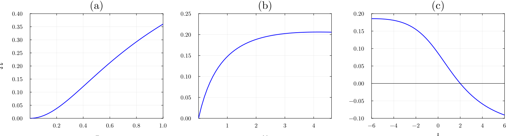
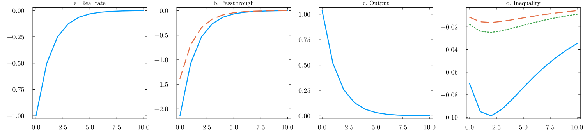
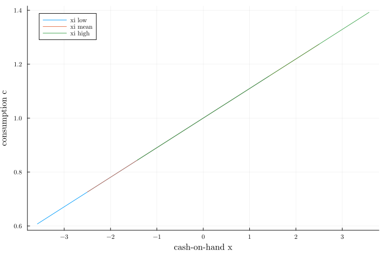
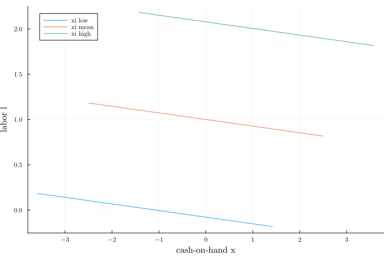
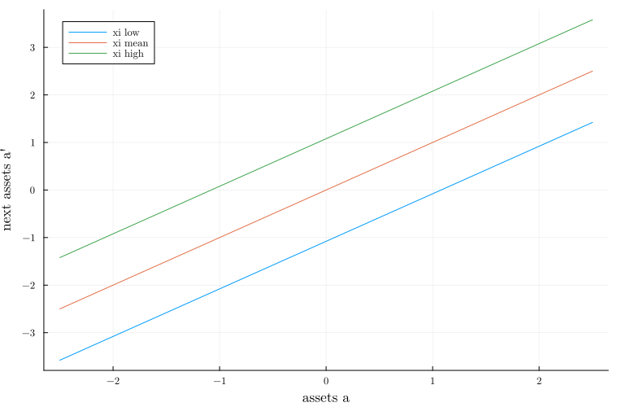
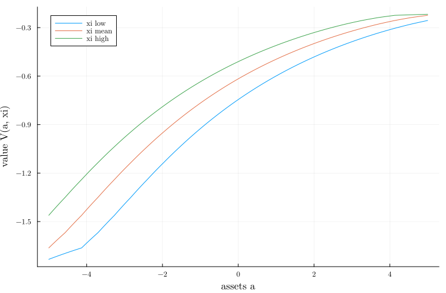
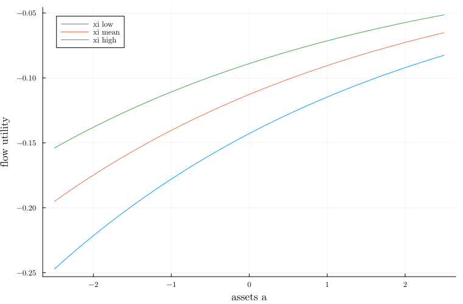

# Overview

This report documents the policy-function and value-function figures generated
by the Julia project in this repository. The model code is stored in
`src/HANKPolicies.jl`, and the scripts in `scripts/` generate the figures used
below.

There is no separate raw-data folder in the project. The reported objects are
model-generated policy functions, value functions, and related diagnostic plots.
The final report figures are stored in `figures/`, while supplementary
diagnostic plots are stored in `output/`.

# Project Organization

```text
src/HANKPolicies.jl                 Core Julia module
scripts/hank-figures.jl             Generates the main report figures
scripts/policy_value_plots.jl       Generates supplementary diagnostics
figures/figure1.png                 Main report Figure 1
figures/figure1.pdf                 PDF version of Figure 1
figures/figure2.png                 Main report Figure 2
figures/figure2.pdf                 PDF version of Figure 2
output/*.png                        Supplementary generated diagnostics
```

# Main Results

The two figures in this section are the main report outputs. They are loaded
directly from the `figures/` directory. The corresponding `.pdf` files are also
available in the same folder for publication or LaTeX workflows.

{#fig-figure1 width="72%"}

{#fig-figure2 width="72%"}

# Supplementary Diagnostics

The figures below are generated by `scripts/policy_value_plots.jl` and saved in
`output/`. They are included here as compact diagnostic panels rather than as
main report figures.

## Policy Functions

::: {layout-ncol=2}
{#fig-cons-assets}

{#fig-cons-coh}

{#fig-labor-assets}

{#fig-labor-coh}
:::

{#fig-savings-assets width="70%"}

## Value and Utility

::: {layout-ncol=2}
{#fig-value-assets}

{#fig-flow-assets}
:::

# Reproducibility

The Julia environment is defined by `Project.toml` and `Manifest.toml`.
To reproduce the outputs from the repository root, run:

```bash
julia --project=. -e 'using Pkg; Pkg.instantiate()'
julia --project=. scripts/hank-figures.jl
julia --project=. scripts/policy_value_plots.jl
```

The expected output locations are:

- `figures/` for the two main report figures.
- `output/` for supplementary policy, value, and utility plots.

Render the report with:

```bash
quarto render report.qmd
```
